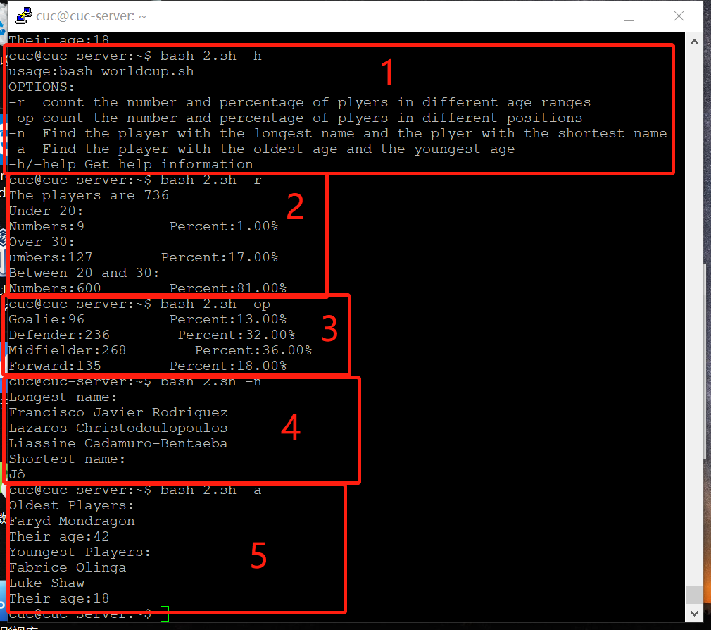
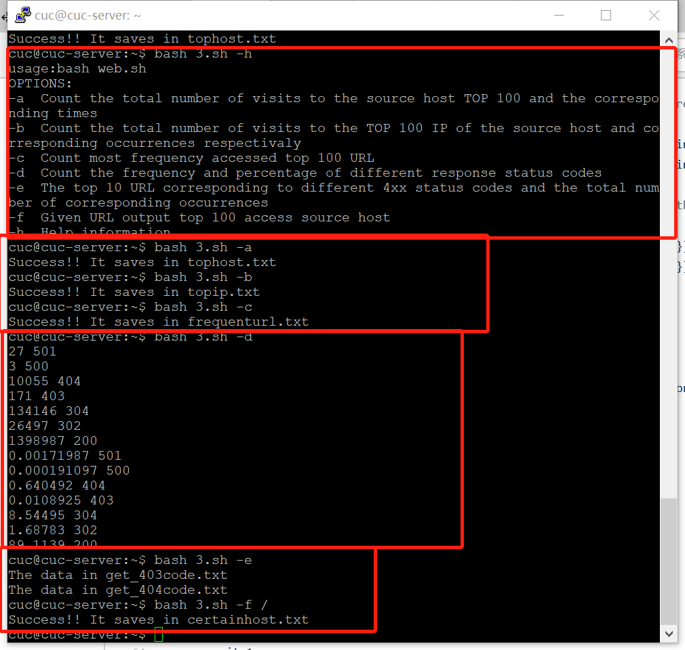

# shell脚本编程练习基础

## 实验环境

ubuntu server 18.04

## 实验目标

任务一：用bash编写一个图片批处理脚本，实现以下功能： 

- 支持命令行参数方式使用不同功能
- 支持对指定目录下所有支持格式的图片文件进行批处理
- 支持以下常见图片批处理功能的单独使用或组合使用 
  - 支持对jpeg格式图片进行图片质量压缩
  - 支持对jpeg/png/svg格式图片在保持原始宽高比的前提下压缩分辨率
  - 支持对图片批量添加自定义文本水印
  - 支持批量重命名（统一添加文件名前缀或后缀，不影响原始文件扩展名）
  - 支持将png/svg图片统一转换为jpg格式图片

任务二：用bash编写一个文本批处理脚本，对以下附件分别进行批量处理完成相应的数据统计任务： 

- [2014世界杯运动员数据](sec.cuc.edu.cn/huangwei/course/LinuxSysAdmin/exp/chap0x04/worldcupplayerinfo.tsv)
  - 统计不同年龄区间范围（20岁以下、[20-30]、30岁以上）的球员数量、百分比
  - 统计不同场上位置的球员数量、百分比
  - 名字最长的球员是谁？名字最短的球员是谁？
  - 年龄最大的球员是谁？年龄最小的球员是谁？

任务三：用bash编写一个文本批处理脚本，对以下附件分别进行批量处理完成相应的数据统计任务： 

- [Web服务器访问日志](sec.cuc.edu.cn/huangwei/course/LinuxSysAdmin/exp/chap0x04/web_log.tsv.7z)
  - 统计访问来源主机TOP 100和分别对应出现的总次数
  - 统计访问来源主机TOP 100 IP和分别对应出现的总次数
  - 统计最频繁被访问的URL TOP 100
  - 统计不同响应状态码的出现次数和对应百分比
  - 分别统计不同4XX状态码对应的TOP 10 URL和对应出现的总次数
  - 给定URL输出TOP 100访问来源主机

## 实验过程

#### 任务二：

1.帮助信息

2.统计不同年龄区间范围（20岁以下、[20-30]、30岁以上）的球员数量

3.百分比统计不同场上位置的球员数量、百分比名字最长的球员是谁？

4.名字最长的球员是谁？名字最短的球员是谁？

5.年龄最大的球员是谁？年龄最小的球员是谁？



#### 任务三：



```bash
#tophost.txt
#统计访问来源主机TOP 100和分别对应出现的总次数
6530 edams.ksc.nasa.gov
4846 piweba4y.prodigy.com
4791 163.206.89.4
4607 piweba5y.prodigy.com
4416 piweba3y.prodigy.com
3889 www-d1.proxy.aol.com
3534 www-b2.proxy.aol.com
3463 www-b3.proxy.aol.com
3423 www-c5.proxy.aol.com
3411 www-b5.proxy.aol.com
3407 www-c2.proxy.aol.com
3404 www-d2.proxy.aol.com
3337 www-a2.proxy.aol.com
3298 news.ti.com
3296 www-d3.proxy.aol.com
3293 www-b4.proxy.aol.com
3272 www-c3.proxy.aol.com
3234 www-d4.proxy.aol.com
3177 www-c1.proxy.aol.com
3134 www-c4.proxy.aol.com
3123 intgate.raleigh.ibm.com
3088 www-c6.proxy.aol.com
3041 www-a1.proxy.aol.com
3011 mpngate1.ny.us.ibm.net
2983 e659229.boeing.com
2957 piweba1y.prodigy.com
2906 webgate1.mot.com
2761 www-relay.pa-x.dec.com
2318 beta.xerox.com
2311 poppy.hensa.ac.uk
2237 vagrant.vf.mmc.com
1910 palona1.cns.hp.com
1793 www-proxy.crl.research.digital.com
1762 koriel.sun.com
1681 derec
1637 trusty.lmsc.lockheed.com
1623 gw2.att.com
1563 cliffy.lfwc.lockheed.com
1503 inet2.tek.com
1485 disarray.demon.co.uk
1467 gw1.att.com
1435 128.217.62.1
1395 interlock.turner.com
1360 163.205.1.19
1354 sgigate.sgi.com
1336 bocagate.bocaraton.ibm.com
1324 piweba2y.prodigy.com
1311 gw3.att.com
1310 keyhole.es.dupont.com
1297 n1144637.ksc.nasa.gov
1292 163.205.3.104
1256 163.205.156.16
1252 163.205.19.20
1216 erigate.ericsson.se
1211 gn2.getnet.com
1089 gwa.ericsson.com
1079 tiber.gsfc.nasa.gov
1054 128.217.62.2
1017 bstfirewall.bst.bls.com
1015 163.206.137.21
1013 spider.tbe.com
1010 gatekeeper.us.oracle.com
995 www-c8.proxy.aol.com
984 whopkins.sso.az.honeywell.com
966 news.dfrc.nasa.gov
949 128.159.122.110
940 proxy0.research.att.com
925 proxy.austin.ibm.com
902 www-c9.proxy.aol.com
901 bbuig150.unisys.com
899 corpgate.nt.com
890 sahp315.sandia.gov
869 amdext.amd.com
848 128.159.132.56
830 n1121796.ksc.nasa.gov
825 igate.uswest.com
819 gatekeeper.cca.rockwell.com
815 wwwproxy.sanders.com
814 gw4.att.com
812 goose.sms.fi
808 128.159.144.83
805 jericho3.microsoft.com
798 128.159.111.141
786 jericho2.microsoft.com
782 sdn_b6_f02_ip.dny.rockwell.com
778 lamar.d48.lilly.com
776 163.205.11.31
772 heimdallp2.compaq.com
771 stortek1.stortek.com
762 163.205.16.75
759 mac998.kip.apple.com
742 tia1.eskimo.com
733 www-e1f.gnn.com
718 www-b1.proxy.aol.com
715 reddragon.ksc.nasa.gov
711 128.159.122.137
701 rmcg.cts.com
701 bambi.te.rl.ac.uk
697 electron.mcc.com
691 163.205.23.76
```

```bash
#hostip.txt
#统计访问来源主机TOP 100 IP和分别对应出现的总次数

6530 edams.ksc.nasa.gov
4846 piweba4y.prodigy.com
4791 163.206.89.4
4607 piweba5y.prodigy.com
4416 piweba3y.prodigy.com
3889 www-d1.proxy.aol.com
3534 www-b2.proxy.aol.com
3463 www-b3.proxy.aol.com
3423 www-c5.proxy.aol.com
3411 www-b5.proxy.aol.com
3407 www-c2.proxy.aol.com
3404 www-d2.proxy.aol.com
3337 www-a2.proxy.aol.com
3298 news.ti.com
3296 www-d3.proxy.aol.com
3293 www-b4.proxy.aol.com
3272 www-c3.proxy.aol.com
3234 www-d4.proxy.aol.com
3177 www-c1.proxy.aol.com
3134 www-c4.proxy.aol.com
3123 intgate.raleigh.ibm.com
3088 www-c6.proxy.aol.com
3041 www-a1.proxy.aol.com
3011 mpngate1.ny.us.ibm.net
2983 e659229.boeing.com
2957 piweba1y.prodigy.com
2906 webgate1.mot.com
2761 www-relay.pa-x.dec.com
2318 beta.xerox.com
2311 poppy.hensa.ac.uk
2237 vagrant.vf.mmc.com
1910 palona1.cns.hp.com
1793 www-proxy.crl.research.digital.com
1762 koriel.sun.com
1681 derec
1637 trusty.lmsc.lockheed.com
1623 gw2.att.com
1563 cliffy.lfwc.lockheed.com
1503 inet2.tek.com
1485 disarray.demon.co.uk
1467 gw1.att.com
1435 128.217.62.1
1395 interlock.turner.com
1360 163.205.1.19
1354 sgigate.sgi.com
1336 bocagate.bocaraton.ibm.com
1324 piweba2y.prodigy.com
1311 gw3.att.com
1310 keyhole.es.dupont.com
1297 n1144637.ksc.nasa.gov
1292 163.205.3.104
1256 163.205.156.16
1252 163.205.19.20
1216 erigate.ericsson.se
1211 gn2.getnet.com
1089 gwa.ericsson.com
1079 tiber.gsfc.nasa.gov
1054 128.217.62.2
1017 bstfirewall.bst.bls.com
1015 163.206.137.21
1013 spider.tbe.com
1010 gatekeeper.us.oracle.com
995 www-c8.proxy.aol.com
984 whopkins.sso.az.honeywell.com
966 news.dfrc.nasa.gov
949 128.159.122.110
940 proxy0.research.att.com
925 proxy.austin.ibm.com
902 www-c9.proxy.aol.com
901 bbuig150.unisys.com
899 corpgate.nt.com
890 sahp315.sandia.gov
869 amdext.amd.com
848 128.159.132.56
830 n1121796.ksc.nasa.gov
825 igate.uswest.com
819 gatekeeper.cca.rockwell.com
815 wwwproxy.sanders.com
814 gw4.att.com
812 goose.sms.fi
808 128.159.144.83
805 jericho3.microsoft.com
798 128.159.111.141
786 jericho2.microsoft.com
782 sdn_b6_f02_ip.dny.rockwell.com
778 lamar.d48.lilly.com
776 163.205.11.31
772 heimdallp2.compaq.com
771 stortek1.stortek.com
762 163.205.16.75
759 mac998.kip.apple.com
742 tia1.eskimo.com
733 www-e1f.gnn.com
718 www-b1.proxy.aol.com
715 reddragon.ksc.nasa.gov
711 128.159.122.137
701 rmcg.cts.com
701 bambi.te.rl.ac.uk
697 electron.mcc.com
691 163.205.23.76
```

```bash
# 统计最频繁被访问的URL TOP 100
97410 /images/NASA-logosmall.gif
75337 /images/KSC-logosmall.gif
67448 /images/MOSAIC-logosmall.gif
67068 /images/USA-logosmall.gif
66444 /images/WORLD-logosmall.gif
62778 /images/ksclogo-medium.gif
43687 /ksc.html
37826 /history/apollo/images/apollo-logo1.gif
35138 /images/launch-logo.gif
30346 /
27810 /images/ksclogosmall.gif
24606 /shuttle/missions/sts-69/mission-sts-69.html
24461 /shuttle/countdown/
24383 /shuttle/missions/sts-69/count69.gif
23405 /shuttle/missions/sts-69/sts-69-patch-small.gif
22453 /shuttle/missions/missions.html
19877 /images/launchmedium.gif
17247 /htbin/cdt_main.pl
12160 /shuttle/countdown/images/countclock.gif
12137 /icons/menu.xbm
12057 /icons/blank.xbm
10345 /software/winvn/winvn.html
10308 /icons/image.xbm
10134 /history/history.html
10126 /history/apollo/images/footprint-logo.gif
9439 /history/apollo/images/apollo-small.gif
9230 /history/apollo/images/footprint-small.gif
9037 /software/winvn/winvn.gif
8985 /history/apollo/apollo.html
8662 /software/winvn/wvsmall.gif
8610 /software/winvn/bluemarb.gif
8583 /htbin/cdt_clock.pl
7865 /shuttle/countdown/liftoff.html
7389 /shuttle/resources/orbiters/orbiters-logo.gif
7261 /images/shuttle-patch-logo.gif
7177 /history/apollo/apollo-13/apollo-13.html
7040 /images/
7029 /shuttle/countdown/video/livevideo2.gif
6615 /images/kscmap-tiny.gif
6517 /shuttle/technology/sts-newsref/stsref-toc.html
6309 /history/apollo/apollo-13/apollo-13-patch-small.gif
5613 /shuttle/missions/sts-71/sts-71-patch-small.gif
5264 /shuttle/missions/sts-69/images/images.html
5248 /icons/text.xbm
5093 /images/construct.gif
4869 /images/shuttle-patch-small.gif
4846 /shuttle/missions/sts-69/movies/movies.html
4791 /shuttle/missions/sts-70/sts-70-patch-small.gif
4785 /icons/unknown.xbm
4559 /shuttle/missions/sts-69/liftoff.html
4464 /facilities/lc39a.html
4434 /shuttle/resources/orbiters/endeavour.html
4365 /history/apollo/images/apollo-logo.gif
4066 /shuttle/missions/sts-70/mission-sts-70.html
4024 /images/lc39a-logo.gif
3817 /shuttle/resources/orbiters/endeavour-logo.gif
3706 /shuttle/technology/sts-newsref/sts_asm.html
3518 /shuttle/countdown/countdown.html
3507 /shuttle/missions/sts-71/movies/movies.html
3377 /shuttle/countdown/video/livevideo.jpeg
3140 /history/apollo/apollo-11/apollo-11.html
3130 /shuttle/missions/sts-71/mission-sts-71.html
3087 /shuttle/missions/sts-70/images/images.html
2945 /shuttle/missions/sts-71/images/images.html
2939 /shuttle/missions/sts-73/mission-sts-73.html
2865 /images/faq.gif
2864 /shuttle/technology/images/srb_mod_compare_1-small.gif
2818 /shuttle/technology/images/srb_mod_compare_3-small.gif
2715 /shuttle/technology/images/srb_mod_compare_6-small.gif
2701 /history/apollo/apollo-11/apollo-11-patch-small.gif
2586 /elv/elvpage.htm
2544 /shuttle/missions/sts-73/sts-73-patch-small.gif
2385 /shuttle/countdown/video/sts-69-prelaunch-pad.gif
2343 /shuttle/missions/51-l/mission-51-l.html
2293 /images/launch-small.gif
2256 /facilities/tour.html
2201 /shuttle/missions/51-l/51-l-patch-small.gif
2172 /images/kscmap-small.gif
2171 /shuttle/resources/orbiters/challenger.html
2159 /shuttle/missions/sts-71/movies/sts-71-launch.mpg
2146 /shuttle/technology/sts-newsref/sts-lcc.html
2133 /htbin/wais.pl
2120 /facts/about_ksc.html
2107 /history/mercury/mercury.html
2040 /images/mercury-logo.gif
1991 /elv/elvhead3.gif
1979 /images/launchpalms-small.gif
1936 /images/whatsnew.gif
1929 /history/apollo/apollo-spacecraft.txt
1915 /facilities/vab.html
1912 /shuttle/resources/orbiters/columbia.html
1908 /shuttle/countdown/lps/fr.html
1904 /shuttle/resources/orbiters/challenger-logo.gif
1892 /images/ksclogo.gif
1891 /whats-new.html
1874 /elv/endball.gif
1869 /history/apollo/apollo-13/apollo-13-info.html
1868 /shuttle/missions/sts-74/mission-sts-74.html
1845 /elv/PEGASUS/minpeg1.gif
1835 /elv/SCOUT/scout.gif
```

```bash
# 统计不同响应状态码的出现次数和对应百分比
27 501
3 500
10055 404
171 403
134146 304
26497 302
1398987 200
0.00171987 501
0.000191097 500
0.640492 404
0.0108925 403
8.54495 304
1.68783 302
89.1139 200
```

```bash
# 分别统计不同4XX状态码对应的TOP 10 URL和对应出现的总次数
23 403:163.135.192.101
21 403:user36.znet.com
21 403:tty18-23.swipnet.se
18 403:bass.hooked.net
12 403:rserio.charm.net
12 403:dialup539.washington.mci.net
11 403:quasar.ed.niigata-u.ac.jp
9 403:foxlake.library.nwu.edu
6 403:erigate.ericsson.se
5 403:pparviee.rautaruukki.fi
62 404:dialip-217.den.mmc.com
47 404:piweba3y.prodigy.com
44 404:155.148.25.4
39 404:maz3.maz.net
38 404:gate.barr.com
37 404:ts8-1.westwood.ts.ucla.edu
37 404:nexus.mlckew.edu.au
37 404:m38-370-9.mit.edu
37 404:204.62.245.32
35 404:scooter.pa-x.dec.com
```

```bash
# 给定URL输出TOP 100访问来源主机 url="\"
206 163.205.19.20
110 www-b5.proxy.aol.com
108 www-b4.proxy.aol.com
105 www-c2.proxy.aol.com
103 www-d3.proxy.aol.com
103 www-c6.proxy.aol.com
103 www-b2.proxy.aol.com
99 www-c4.proxy.aol.com
98 www-d4.proxy.aol.com
97 www-a2.proxy.aol.com
93 192.77.40.4
92 www-d1.proxy.aol.com
89 www-c3.proxy.aol.com
89 piweba5y.prodigy.com
87 163.206.140.4
85 www-c1.proxy.aol.com
84 163.205.1.19
82 www-d2.proxy.aol.com
82 piweba4y.prodigy.com
81 www-a1.proxy.aol.com
80 www-b3.proxy.aol.com
76 www-c5.proxy.aol.com
75 piweba3y.prodigy.com
74 intgate.raleigh.ibm.com
73 mpngate1.ny.us.ibm.net
67 163.205.23.71
66 se1720.ksc.nasa.gov
61 piweba1y.prodigy.com
61 128.159.129.222
59 128.159.168.162
58 163.206.89.4
55 webgate1.mot.com
55 192.112.22.119
54 smshub.ksc.nasa.gov
52 redfish.ksc.nasa.gov
49 disarray.demon.co.uk
49 128.217.62.224
49 128.217.61.184
48 163.205.166.19
47 unifex.ksc.nasa.gov
47 poppy.hensa.ac.uk
46 128.159.129.221
44 n868370.ksc.nasa.gov
43 p2077jdy.ksc.nasa.gov
43 193.178.53.180
43 192.112.239.127
42 bocagate.bocaraton.ibm.com
41 e659229.boeing.com
41 163.205.23.9
40 139.169.135.185
39 starbright.ksc.nasa.gov
39 marvel.stsci.edu
39 gw3.att.com
39 emllab.ksc.nasa.gov
39 163.205.166.3
38 147.74.41.186
38 128.159.129.170
37 sdn_b6_f02_ip.dny.rockwell.com
37 kb056003.ksc.nasa.gov
36 vagrant.vf.mmc.com
35 128.217.61.144
35 128.159.129.156
34 www-relay.pa-x.dec.com
34 www-proxy.crl.research.digital.com
34 news.ti.com
34 interlock.turner.com
34 133.53.64.33
34 128.159.112.47
33 192.112.22.166
33 163.206.113.134
32 pl23769.ksc.nasa.gov
32 128.159.154.115
31 grumpy.ksc.nasa.gov
31 128.217.61.186
31 128.159.121.34
30 163.205.12.166
30 128.217.62.226
30 128.217.61.41
29 gw2.att.com
29 163.206.204.11
29 128.217.62.136
28 piweba2y.prodigy.com
28 palona1.cns.hp.com
27 keyhole.es.dupont.com
27 gw1.att.com
27 crag.mcs.anl.gov
27 acquinas.netmind.com
27 192.112.22.127
27 163.205.46.95
26 proxy0.research.att.com
26 n868217.ksc.nasa.gov
26 163.206.130.137
26 128.217.61.192
25 waldtsvr.ksc.nasa.gov
25 dove.ksc.nasa.gov
24 smtp.inet.fi
24 n861692.ksc.nasa.gov
24 bstfirewall.bst.bls.com
24 bbuikema.pcshs.com
23 www-c9.proxy.aol.com
```

