# 无人值守Linux安装镜像制作

## 实验环境

- Virtualbox
- Ubuntu18.04 Server 64bit
- 双网卡
  - 网卡一：NAT
  - 网卡二：Host-only

## 实验目的

- 配置无人值守安装iso并在Virtualbox中完成自动化安装。

- Virtualbox安装完Ubuntu之后新添加的网卡实现系统开机自动启用和自动获取IP
- 使用sftp在虚拟机和宿主机之间传输文件

## 实验步骤

1.打开host-only网卡

查看网卡信息只有一张网卡

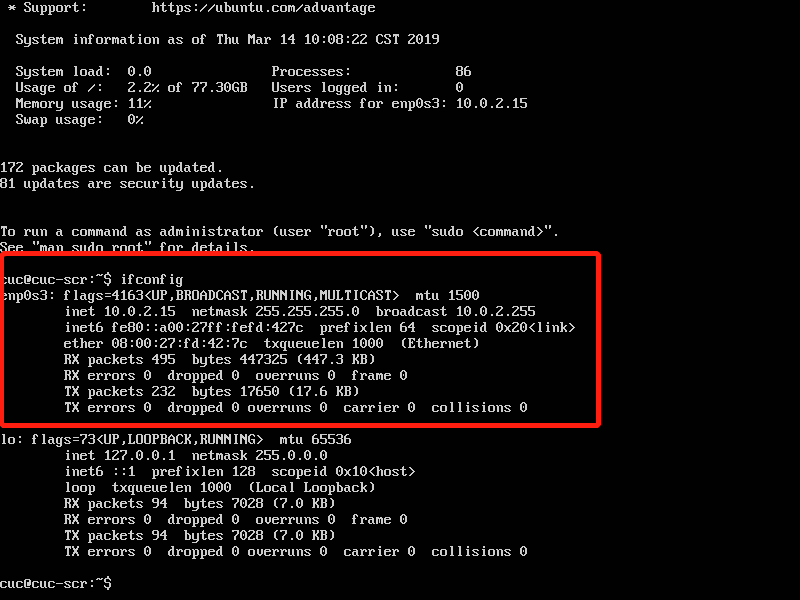

```
#使用命令sudo vim /etc/netplan/01-netcfg.yaml打开文件,在文件中增加
enp0s8:
dhcp4: yes (冒号后必须要有空格)
#增加完成后，使用sudo netplan apply 使以上的配置生效
```

完成后就能看到有双网卡

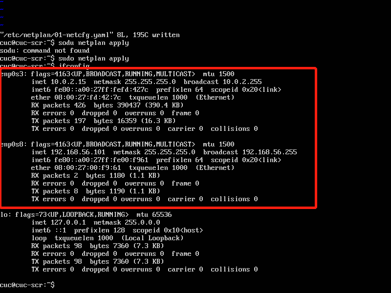

2.实现免密登录

首先先用puttygen生成一个密钥对

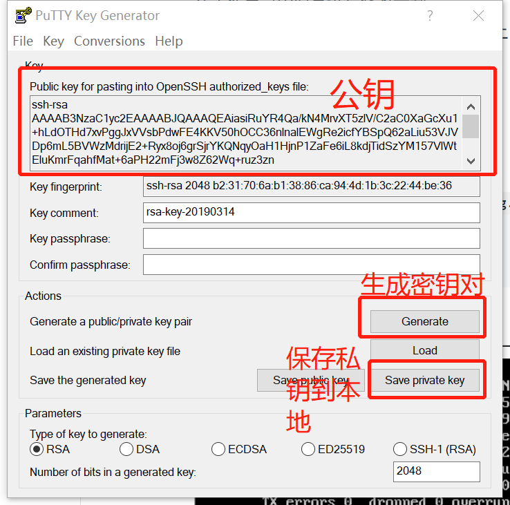

将putty打开

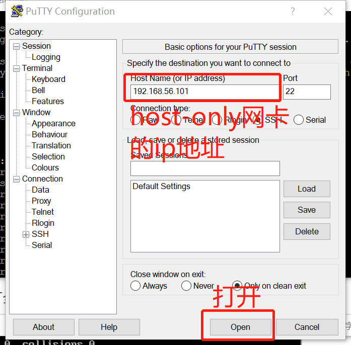

打开后使用命令sudo vim ~/.ssh/authorized_keys后在文件中保存上面生成的公钥。

然后再次打开putty，将私钥加入，然后再次打开。

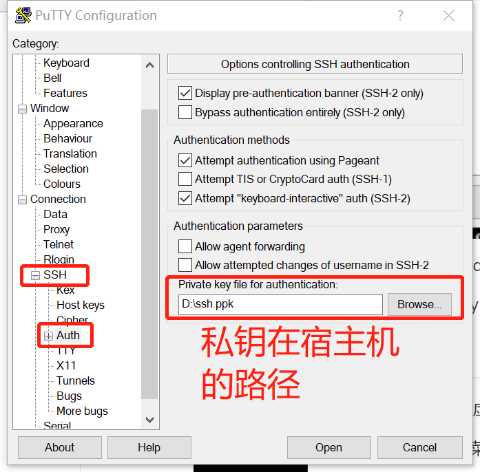

然后此次打开我们就不需要再次输入密钥了

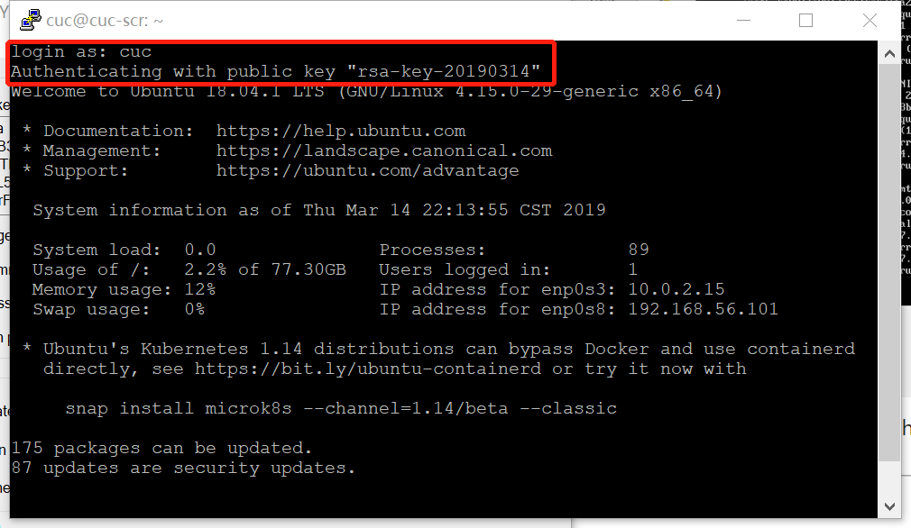

3.使用sftp在宿主机和虚拟机之间传输文件

```
#在gitbash中使用sftp
#连接虚拟机进行sftp
stfp 用户名@host-only的ip地址

#查看当前的路径
lpwd

#查看即将要传输的路径
pwd

#将宿主机上的镜像传输到虚拟机
put D:/ubuntu-18.04.1-server-amd64.iso /home/cuc
```

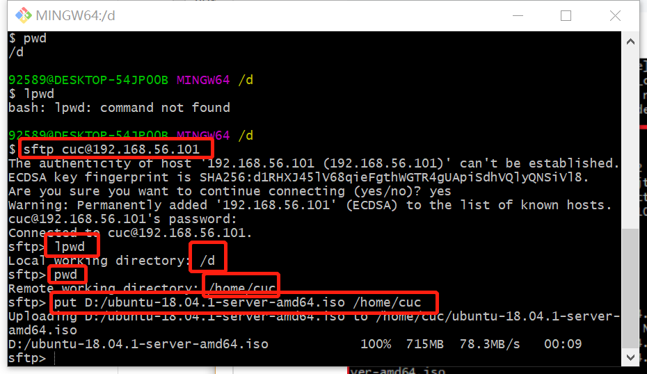

4.创建定制版无人值守的iso镜像文件

```
#在虚拟机上进行如下操作
#根据实际情况，自行替换其中的参数
#在当前用户目录下创建一个用于挂载iso镜像文件的目录
mkdir loopdir

#挂载iso镜像文件到该目录
mount -o loop ubuntu-16.04.1-server-amd64.iso loopdir

#创建一个工作目录用于克隆光盘内容
mkdir cd
 
#同步光盘内容到目标工作目录
#一定要注意loopdir后的这个/，cd后面不能有/
rsync -av loopdir/ cd

#卸载iso镜像
umount loopdir

#进入目标工作目录，之后的操作都在此目录下完成
cd cd/

#编辑Ubuntu安装引导界面增加一个新菜单项入口
vim isolinux/txt.cfg
#添加新菜单项入口就添加以下内容到该文件后强制保存退出（强制保存并退出的指令为:wq!）
  label autoinstall
  menu label ^Auto Install Ubuntu Server
  kernel /install/vmlinuz
  append  file=/cdrom/preseed/ubuntu-server-autoinstall.seed debian-installer/locale=en_US console-setup/layoutcode=us keyboard-configuration/layoutcode=us console-setup/ask_detect=false localechooser/translation/warn-light=true localechooser/translation/warn-severe=true initrd=/install/initrd.gz root=/dev/ram rw quiet
```

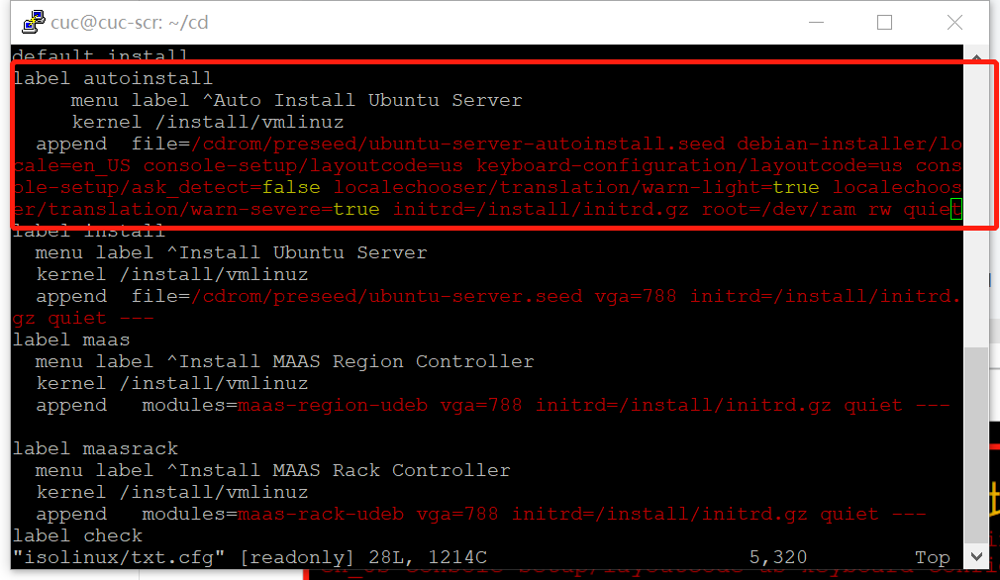

用上面传输镜像的方法将主机上的ubuntu-autointall.seed移到/home/cuc/cd/preseed中

此时我们第一次传输的时候出现了权限不够的情况，这时我们先把文件移到虚拟机

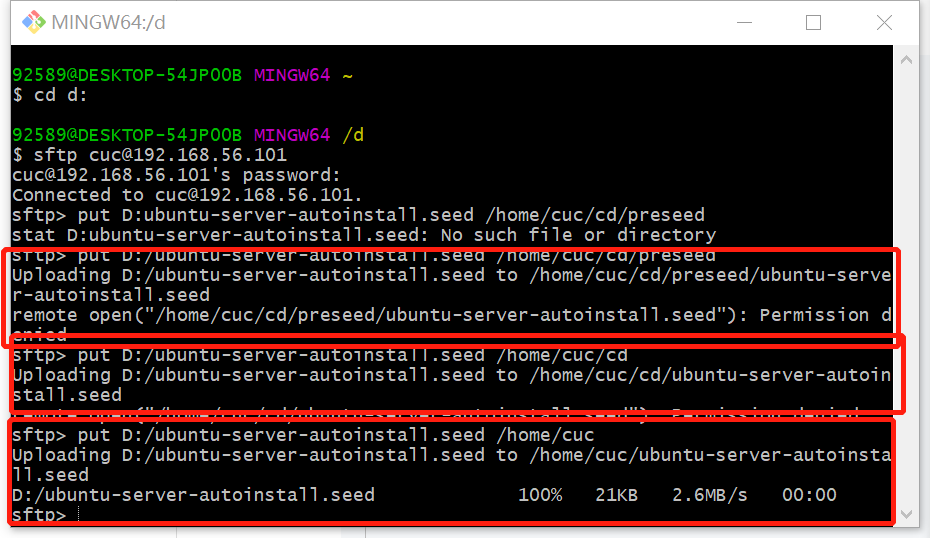

然后再把文件传到目的目录

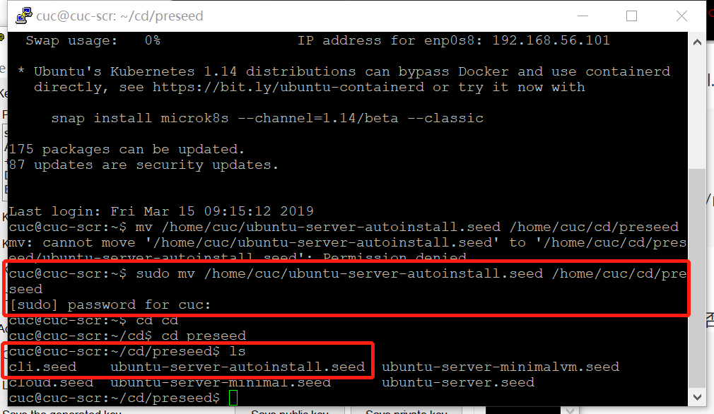

修改isolinux/isokinux.cfg,将timeout=0改为timeout=10

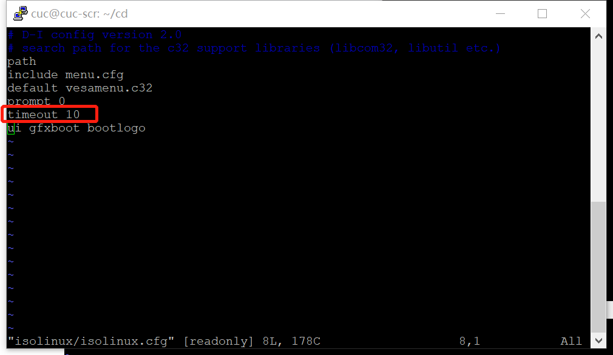


```
#重新生成md5sum.txt，由于权限不够，所以先对要操作的文件进行提权
sudo chmod 777 md5sum.txt
find . -type f -print0 | xargs -0 md5sum > md5sum.txt
  
#封闭改动后的目录到.iso，会提示没有mkisofs,安装genisoimage
apt-get install genisoimage

# 打开脚本
vim shell

# 添加以下内容
# 封闭改动后的目录到.iso
IMAGE=custom.iso
BUILD=~/cd/

mkisofs -r -V "Custom Ubuntu Install CD" \
           -cache-inodes \
           -J -l -b isolinux/isolinux.bin \
           -c isolinux/boot.cat -no-emul-boot \
           -boot-load-size 4 -boot-info-table \
           -o $IMAGE $BUILD


# 执行shell脚本。
sudo bash shell
```

我们创建的脚本为

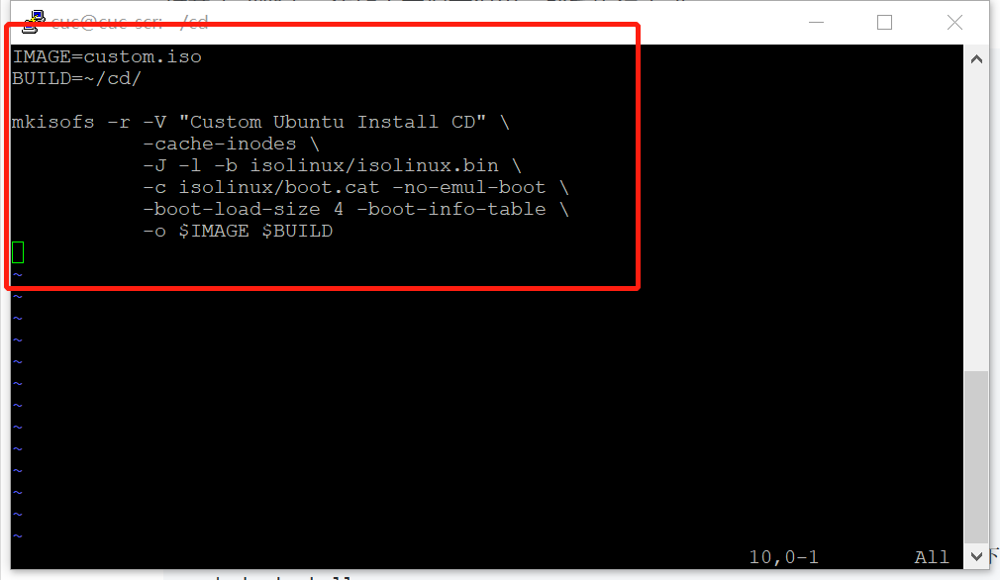

执行脚本后，我们看到当前目录下生成了一个custom.iso

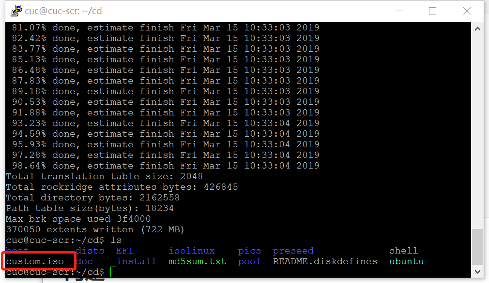

将此镜像从虚拟机传到宿主机。

```
# 因为权限的关系，我们先把文件移动到/home/cuc中
mv /home/cuc/cs/custom.iso /home/cuc

# get 目标文件目录 本地文件目录
  get /home/cuc/custom.iso D:/
```

然后我们用生成的iso创建一个虚拟机就好

5.脚本对比

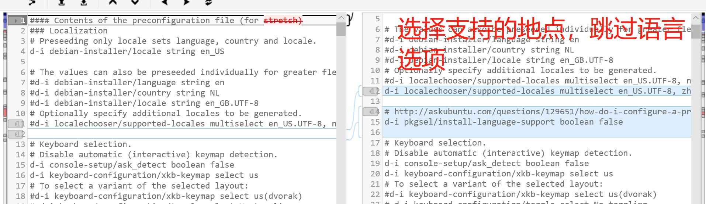

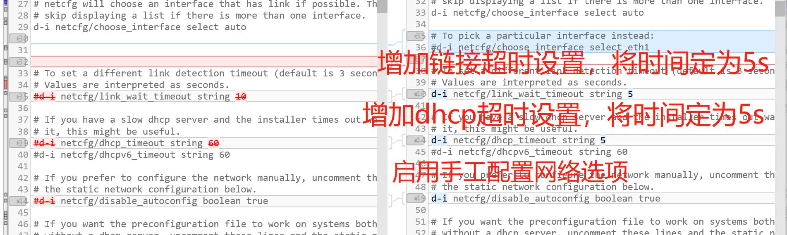

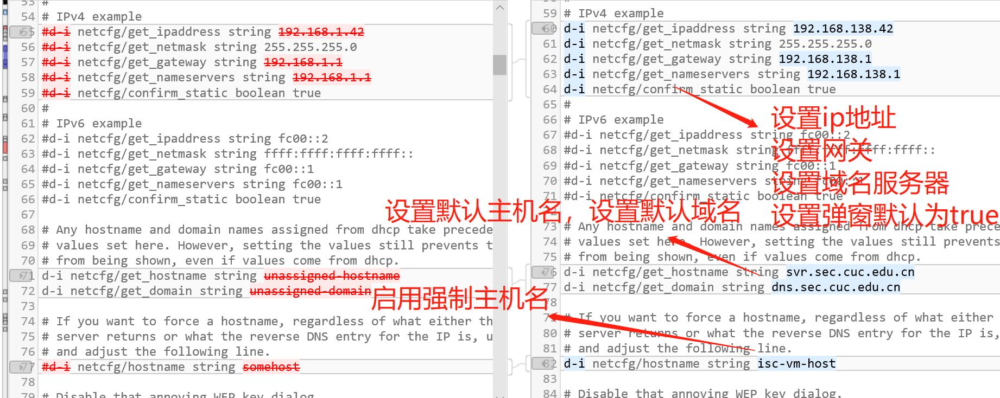

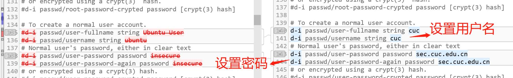

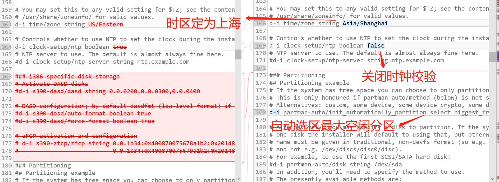

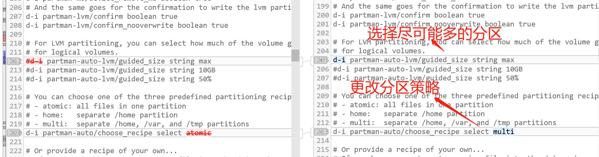

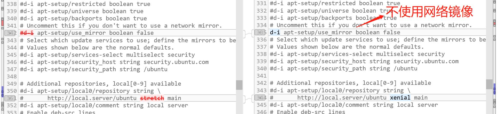

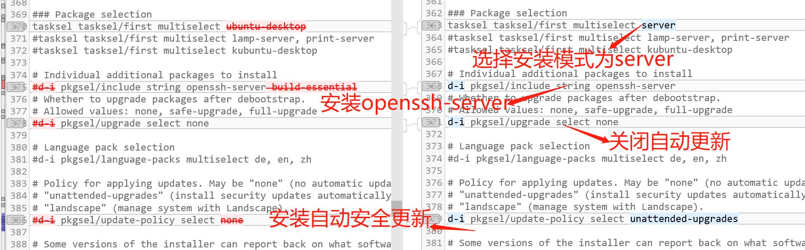

## 遇到的问题

1. vitualbox设置虚拟机无法选用host-only的连接方式。

- 在VirtualBox 菜单「管理」-「全局设定」-「网络」，为该模式增加一块网卡，未能解决。
- 打开主机中host-only的网卡就能正常运行。

## 参考文献

[CUCCS/linux-2019-luyj/Linux_exp0x01](https://github.com/CUCCS/linux-2019-luyj/blob/bcc1a93af56faa9b8cea2144efc890b358f229cb/Linux_exp0x01/%E5%AE%9E%E9%AA%8C%E6%8A%A5%E5%91%8A_01.md)

[putty配置ssh免密登录](https://blog.csdn.net/zhaoxixc/article/details/82314957)

[CUCCS/linux-2019-FLYFLY-H/chap0x01](https://github.com/CUCCS/linux-2019-FLYFLY-H/edit/linux_exp1/exp_1.md)

[CUCCS/linux-2019-Lyc-heng/chap0x01](https://github.com/CUCCS/linux-2019-Lyc-heng/blob/chap0x01/chap0x01/chap0x01.md)

