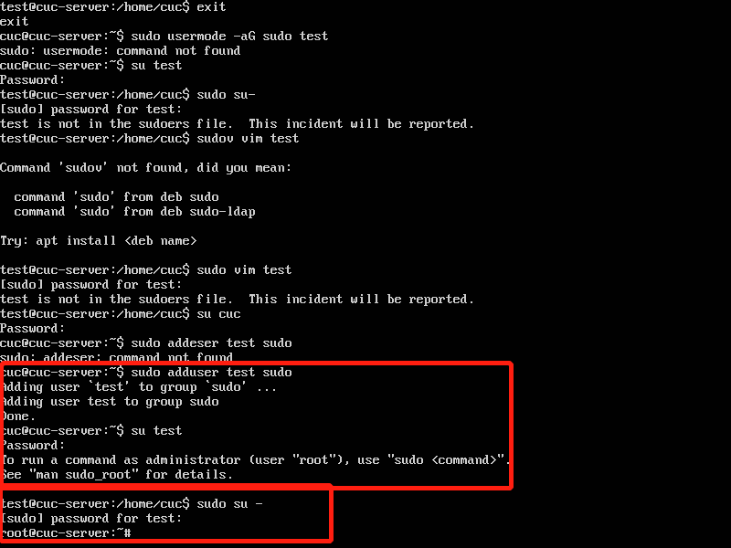
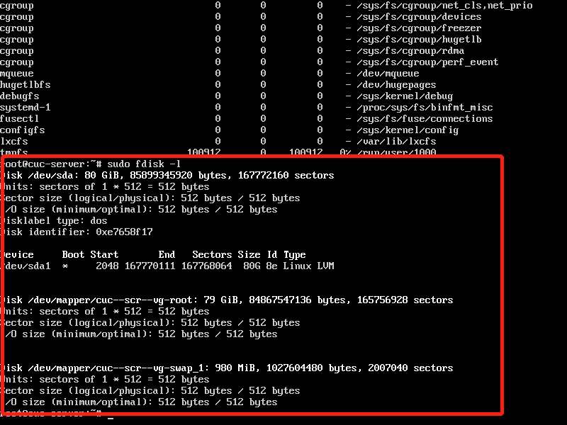
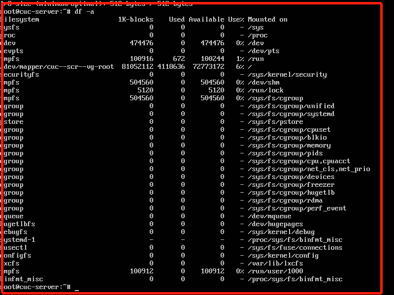
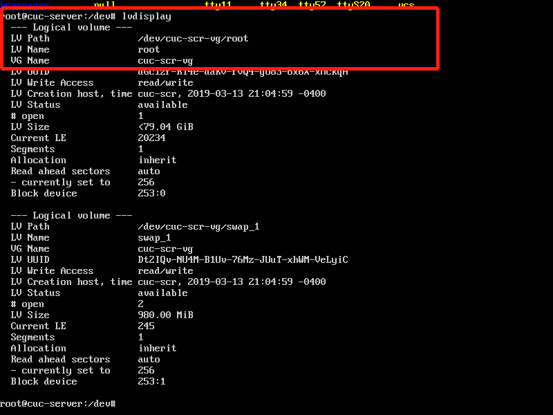

# Systemd入门

## 实验环境

- ubuntu-18.04.1-server-amd64.iso
- 双网卡
  - NAT
  - Host-Only

## 实验步骤

### 命令篇

#### 系统管理

[](https://asciinema.org/a/237323)

#### Unit

[](https://asciinema.org/a/237349)

#### Unit的配置文件 

[](https://asciinema.org/a/237354)

#### Target

[](https://asciinema.org/a/237338)

#### 日志管理

[](https://asciinema.org/a/237358)

### 实战篇

[](https://asciinema.org/a/237477)

## 自查清单

- 如何添加一个用户并使其具备sudo执行程序的权限？

  ```bash
  # 添加一个普通用户
  # sudo adduser username
  sudo adduser tset
  
  # 将某用户加入某个组内
  # sudo adduser username usergroup
  # sudo代表具备sudo的执行权限
  sudo adduser test sudo
  
  # 切换到用户test
  su test
  
  # 执行sudo
  # 此时具有sudo执行程序权限
  sudo su -
  ```

  

- 如何将一个用户添加到一个用户组？

  ```bash
  # 创建一个新的用户组
  # sudo groupadd groupname
  sudo groupadd friend
  
  #将创建好的用户加入到某个组中
  # sudo adduser username groupname
  sudo adduser test friend
  ```

​        

- 如何查看当前系统的分区表和文件系统详细信息？

  ```bash
  #查看当前系统分区表
  sudo fdisk -l
  
  #查看文件详细信息
  df -a
  ```

  

  

- 如何实现开机自动挂载Virtualbox的共享目录分区？

    ```bash
    # VirtualBox中的设置->共享文件夹->添加共享文件->选择要共享的文件夹，勾选固定分配和自动加载
    #创建挂载目录
    mkdir ~/shared
    
    #挂载文件夹
    sudo mount -t vboxsf test ~/shared
    
    #修改配置
    sudo vim /etc/fstab
    #在此文件中增加
    test /home/cuc/shared vboxsf defaults 0 0
    ```

- 基于LVM（逻辑分卷管理）的分区如何实现动态扩容和缩减容量？

   ```bash
   #查看逻辑卷信息
   sudo lvdisplay
   
   #实现动态扩容
   sudo lvextend -L +32M /dev/cuc-scr-vg/root
   
   #缩减扩容
   sudo lvreduce -L -32M /dev/cuc-scr-vg/root
   ```




- 如何通过systemd设置实现在网络连通时运行一个指定脚本，在网络断开时运行另一个脚本？

```bash
# 利用脚本A打开脚本B
# 在networkManager.service的区块service中进行以下修改
[Service]
......
ExecStartPost= A
ExecStopPost= B
......
```

- 如何通过systemd设置实现一个脚本在任何情况下被杀死之后会立即重新启动？实现**杀不死**？
  - 将这个配置文件的service区块中的restart字段设置为always。

## 参考文献

- [Systemd 入门教程：命令篇 by 阮一峰的网络日志](http://www.ruanyifeng.com/blog/2016/03/systemd-tutorial-commands.html)
- [Systemd 入门教程：实战篇 by 阮一峰的网络日志](http://www.ruanyifeng.com/blog/2016/03/systemd-tutorial-part-two.html)